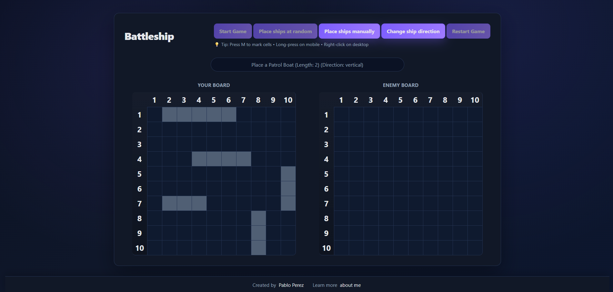
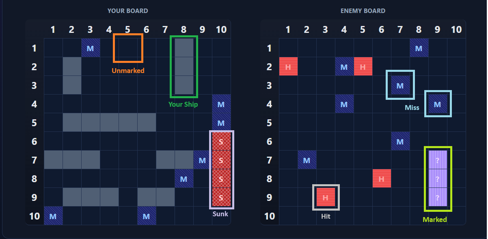

# Battleship Game

A fully-featured, accessible Battleship game built with vanilla JavaScript, featuring an intelligent AI opponent, multiple control options, and a polished user interface.

**[Play the Game](https://yaoming16.github.io/TOP-Battleship/)**


_Game in action showing both player and enemy boards with various attack states_


_Game in action showing the ship placement phase_

## About

This project was created as part of [The Odin Project curriculum](https://www.theodinproject.com/lessons/node-path-javascript-battleship), focusing on test-driven development, object-oriented programming, and creating an engaging user experience.

## Game Rules

Battleship is a classic naval strategy game where you try to sink all of your opponent's ships before they sink yours.

### Fleet Composition

-   **1 Carrier** (5 cells)
-   **1 Battleship** (4 cells)
-   **2 Destroyers** (3 cells each)
-   **1 Submarine** (3 cells)
-   **3 Patrol Boats** (2 cells each)

### Objective

Attack cells on the enemy board to locate and sink all their ships. The first player to sink all enemy ships wins!

## How to Play

### Setup Phase

1. **Place Your Ships**

    - Click **"Place ships at random"** for automatic placement
    - Or click **"Place ships manually"** to position each ship yourself
    - When placing manually, use **"Change ship direction"** to toggle between horizontal and vertical orientation
    - Click on your board to place each ship

2. **Start the Game**
    - Once all ships are placed, click **"Start Game"**

### Battle Phase

1. **Make Your Attack**

    - Click any cell on the **Enemy Board** (right side) to attack
    - Your board (left side) shows your ships and where the AI has attacked

2. **View Results**

    - **M** = Miss (blue cell with diagonal pattern)
    - **H** = Hit (red cell with horizontal lines)
    - **S** = Sunk (dark red cell with crosshatch pattern)

3. **AI's Turn**

    - After you attack, the AI automatically counterattacks
    - Watch your board to see where the AI strikes

4. **Win the Game**
    - Sink all enemy ships before they sink yours!
    - Use **"Restart Game"** to play again with a fresh setup

## Visual Indicators


_Visual guide showing different cell states and patterns_

### Cell Colors & Patterns

| State         | Color     | Pattern          | Indicator                               |
| ------------- | --------- | ---------------- | --------------------------------------- |
| **Unmarked**  | Dark Blue | None             | Empty ocean                             |
| **Your Ship** | Gray      | None             | Your fleet (hidden from enemy)          |
| **Marked**    | Purple    | Vertical lines   | `?` - Cells you've marked for reference |
| **Miss**      | Blue      | Diagonal lines   | `M` - Missed attack                     |
| **Hit**       | Red       | Horizontal lines | `H` - Ship damaged                      |
| **Sunk**      | Dark Red  | Crosshatch       | `S` - Ship destroyed                    |

### Visual Patterns

-   **Diagonal lines**: Missed shots
-   **Horizontal lines**: Hit but not sunk
-   **Crosshatch**: Ship completely sunk
-   **Vertical lines**: User-marked cells

## Accessibility Features

This game is built with accessibility in mind:

### Keyboard Controls


_Responsive design with mobile accessibility features_

-   **Tab / Shift+Tab**: Navigate between cells and buttons
-   **Arrow Keys**: Move between cells on the board
-   **Enter / Space**: Attack a cell
-   **M Key**: Mark/unmark a cell

### Screen Reader Support

-   All buttons have descriptive `aria-label` attributes
-   Game status updates are announced via `aria-live` regions
-   Cells are keyboard-focusable with visible focus indicators

### Mobile Support

-   **Touch**: Tap cells to attack
-   **Long Press** (500ms): Mark/unmark cells on mobile devices

### Additional Features

-   High contrast colors for better visibility
-   Clear visual focus indicators (purple outline)
-   Responsive design for all screen sizes
-   Right-click to mark cells on desktop

## 🤖 AI Strategy

The AI opponent uses an intelligent targeting system:

1. **Random Attack Mode**

    - Initially attacks random cells
    - Searches for ships across the board

2. **Target Mode (First Hit)**

    - After hitting a ship, attacks adjacent cells (up, down, left, right)
    - Attempts to determine ship orientation

3. **Hunt Mode (Multiple Hits)**
    - Once the ship's direction is identified, continues attacking along that line
    - Tries both ends of the ship to maximize damage
    - Resets to random mode after sinking a ship

The AI won't attack the same cell twice and intelligently handles edge cases like board boundaries and previously attacked areas.

## 🛠️ Technologies Used

-   **JavaScript (ES6+)**: Core game logic, OOP principles
-   **HTML5**: Semantic structure
-   **CSS3**: Modern styling with CSS Grid, custom properties, gradients
-   **Webpack**: Module bundling and build process
-   **Jest**: Unit testing framework

## 🧪 Testing

The project includes comprehensive unit tests for core game logic:

```bash
npm test
```

Tests cover:

-   Ship placement and validation
-   Attack mechanics
-   Game state management
-   AI decision-making
-   Board boundary checking

## Local Development

```bash
# Clone the repository
git clone https://github.com/yaoming16/TOP-Battleship.git

# Install dependencies
npm install

# Run development server
npm run dev

# Build for production
npm run build

# Deploy to GitHub Pages
npm run deploy
```

## Links

-   [Play the Game](https://yaoming16.github.io/TOP-Battleship/)
-   [The Odin Project Lesson](https://www.theodinproject.com/lessons/node-path-javascript-battleship)
-   [GitHub Repository](https://github.com/yaoming16/TOP-Battleship)

## Author

**Pablo Perez**

-   GitHub: [@yaoming16](https://github.com/yaoming16)
-   Portfolio: [yaoming16.github.io](https://yaoming16.github.io/)
